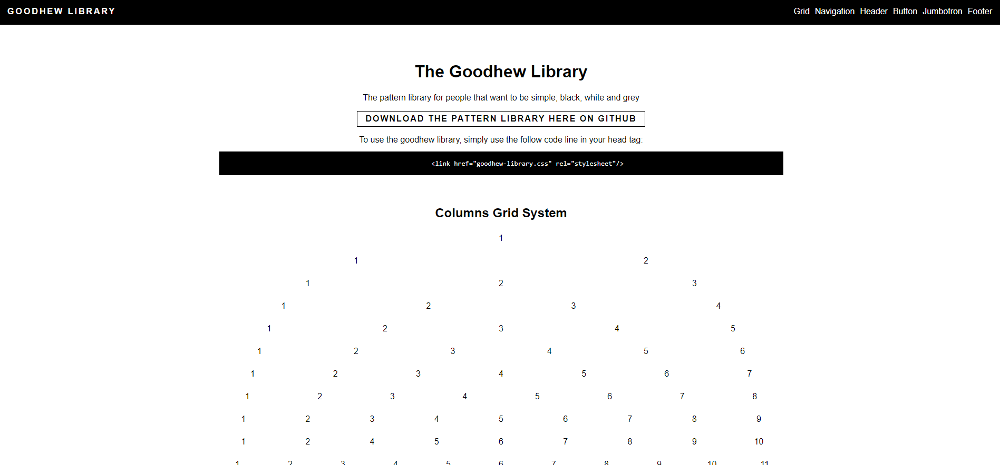

# Creating a Pattern Library

Pattern Library is made up of a collection of grids, typography, color, code and much more it is the collection of these object which creates a pattern library, the main outcome of a pattern library is the ability to have a seamless style thought all elements so that someone can chose a pattern library and build their web page around the library that you have created.

By Niall Goodhew

Web Design for Industry

12 May 2019

View Pattern Library Fire Base Link: [https://goodhew-library.firebaseapp.com/](https://goodhew-library.firebaseapp.com/)

GitHub repository: [https://github.com/0GOODN34/Goodhew-Pattern-Library](https://github.com/0GOODN34/Goodhew-Pattern-Library)

 

#

#

# Introduction

#

Project Background

Pattern Library have been in use for many years now with many people search the web for certain library which will help them to customize their own websites though the use of different elements such as buttons, cards, carousels, jumbotron and navbars this is a brief list of items that can be found in many forms of pattern library&#39;s, with different pattern library holding different elements in each.

Most users of these elements that have been mentioned will also use well know frameworks such as [bootstrap](https://getbootstrap.com/), [UIKit](https://getuikit.com/), [Pure](https://purecss.io/)and many more all of these frameworks contain a list of elements and also sample code which can be used by everyday users on their own websites.

Project Aims

The aim of this project is to build a pattern library from scratch using research gathered from multiple sources to come up with a brand new pattern library with multiple elements that have been considered to be most useful to the everyday user, also while providing the user with a snap shot of the code behind the element so they have the ability to be able to create that element on their own web page with the ability to take also the style and color of the element as well.

Also, alongside the created pattern library would be a markdown documentation that would also contain information about the pattern library and the steps involved in its creation.

# Research

#

Why should we create a pattern library?

Reading into Paul Boag blog, talks about what is the point in creating a pattern library(&quot;Boag,2019&quot;), with large companies always on the grow and sometimes never having the time to create a pattern library. as this takes a long time to create, as when a web designer goes to change part of the website they would rather create a new button than look into finding out how the old button was created other other elements on the web page.

But with this comes the trouble of changes that have not been thought of effecting other parts of the page with sometimes the navigation can be moved though the developer increasing a button by a couple of pixels or changing a color that does not match the rest of the layout.

The solution to this is a pattern library if you can create a core pattern library that everyone must use when editing a website or even creating a new one then all websites will look the same and should have the same layout making it easier for customers to navigate though the page, also developers down the line can also pick up where the old developer left off by just using the pattern library.

Creating a pattern library?

When creating a pattern library from scratch it can be daunting of where to actually start from as creating a web site from from the start does take a long time, some option that are available to just get a start

into the design would be Wire frames website (&quot;wireframes&quot;,2019) this software can be used to get the basic layout for the website which is helpful as a start to understand how the pattern library will look, another option is pattern lab (&quot;Pattern Lab&quot;,2019)a website that can be used to create elements and templates of various options for the ability to be used on websites.

**Existing pattern library&#39;s**

After reading the blog, finding out that there were a wide range of pattern library&#39;s that already exist, gathering information by viewing the websites layout and how they present the code to the users that visit their sites, helped in understanding how this pattern library could be layout out the easiest way to understand for users visiting the site. Though look at sites such as bootstrap(&quot;bootstrap&quot;,2019)mainly and many other this helped decide the outcome for the layout of the pattern library.

Outcome

Though looking at the different options listed on the web I came to conclusion of following various tutorials and learning on the go, but before all of this creating a understand of what elements and what they would each contain would be a baseline created a draft outline of the pattern library to the creation.

# Design Process Method

#

Mostly commonly know as the SDLC or the Software Development Life Cycle is a process that is normally used when creating development software, normally the cycle never end with only the first copy starting as only an idea and then eventually becoming a prototype to eventually

being released for use, but the cycle does not end their it continues with that first copy having testing preformed and then the software being updated and slowly changed causing iterations of the same software with updated versions to be released and this is why the cycle continues.

SDLC Model

 

Agile which is a vast improvement on the waterfall model helps to focus on the users experience and also testing of the code and feedback and also prototypes, this model will work will with the creation of the pattern library as testing and feedback will be a big part of understand if the pattern library works well for users.

Agile will be used in my testing stage and throughout the development of my app with gaining feedback on my website and then working on the feedback given to improve certain area&#39;s of the website and then repeat this process until the website is in a working condition.

# Plan/Process of testing

#

Creating of any software when being a developer is the ability to be able to test the software you have created to the best of your ability though user testing, unit testing and many more. As being able to remove as many errors as possible is beneficial for you and your users.

Technical Testing

When performing technical testing it is a major step in making sure that the software that you have created is of a high quality and users are able to understand what you have displayed on the pattern library, also making sure that all of the elements that you have created on the page are working.

Documenting of the testing

Web develops when creating a piece of software will always create documentation to go along with the software this will include also checking that all of the code that has been created has been checked for syntax errors, the best way that this can be checked would be to perform the same action that a user would have by copying the code you have created and testing it to see if you can get the element to work on a fresh website.

Within the documentation will also have to be recorded if certain elements are unable to work on certain browsers as this could have a big effect when other people are viewing either your pattern library or using your code to work with their own website, as such browsers such as internet explore 9 has had big issues with understanding of new coding languages that have been developed.

User Testing

Main area to be covered in this testing would be interaction with users to understand if your layout of the pattern library they can understand and work with as otherwise your main audience that will be using the software will not want to use the pattern library, so for this section a variety of tests will be asked of users in which checking the layout of the pattern library their ability to understand how to access an element on the page and copy what they see to their own website.

If a user is unable to understand what is going on then they will not use the library, also recording of this information also needs to be made in the documentation side so users can use this to understand each element on the page with easy instruction of what to do to use each individual element.

# Specification

#

The pattern library has to have some basic elements with the option to create advanced elements if needed as this pattern library was a creation from scratch and should contain main elements of:

Navigation Bar

Header Element

Buttons

Jumbotron

Footer

Special Component

Responsive grid system

 

These elements should be included on the pattern library with code snippiest available for most elements.

# Design &amp; Planning

#

Designs

Planning of what the layout of each element that will be displayed on the web page will help give a understand of how the pattern library will look and give a baseline of what the software is looking to become.

Movable navigation bar so that users can access any part of the pattern library when needed.

Each Element will have a header.

Code sample will be provided underneath the example.

 

Document sketch

Using wire frames an online website normally used to create websites, helped to give a layout of what the pattern library was going to look like, this pattern library will have it were the navbar will move along with the user to always keep the navbar in view so that they can jump around the pattern library when they need to.

 

The outline for the pattern library will be similar to the above sketch with subtle changes.

Element Designs

Having elements that the user is ability to interact with was a big step in making the user understand more about a that element that they were looking to add to their website so below is showing the interaction of the different buttons and also showing the different colors that were available for different button with different tasks.

Some of the elements will need to have some form of JavaScript running in the background to work such as the carousel.

**Button Styles**

 

Showing users what the different colors are for at the ability to intact with the buttons above and below helps the users to understand how they work.

Button Sizes

 

Button sizes so the user can choose what size button they would like on their website all interact as well.

Experimentation

Nav Bar Experimentation worked out that a fixed nav would be better than a moving navigation bar.

Flex box grid Experiment

This experiment was trying to get the flex box system working on the pattern library so users were able to decrease the size of the screen in which the grid would re position to adjust for screen size which worked out very well, with being able to adapt to changes quickly and being able to also adapt the space between the content as well.

Normal

 

Flex

# Implementation

#

Implementation of the Grid system was eventually carried out with having to use certain tags such as the ones you see below such as row this is used as a wrapper for columns ,col-12 and other with change the amount of columns which can be col-6 for half the screen, col-4 to split the screen into 3 and many more options. col is used as vertical alignment of elements. container and section are similar tags with container making the maximum size 70% of the parent container with section using the full width of the screen.

.col-12
 

Implementation of Elements

Below is a selection of images showing the interaction between the user

and the elements on the screen.

**Buttons**

Standard Button

Large Button

Small Button

White button

Grey Button

Text Button

 

**Hover**

All buttons have a hover effect which changes the opacity of the button to left the user know that they have hovered over the button.

**Jumbotron**

 

Hover

Button because lighter when hovered.

**Navigation**

 

**Hover**

Cannot be seen but the cursor because the hand icon when hover over  a link.

**Grid**

 

**Carousels**

Slide 1

Slide 2

 

Slides switch between each other on a animation timer this slide show can have a max of 6 slides which can rotate on a selected amount of time.

 

**Footer**

 

 

Modal

 
**Clicked**

# Conclusion- Reflection

#

When the library was finished, I wanted to find out what people thought about the website with some general questions once they have used the website which gave me some insights into what people think about the pattern library I have created.

Overall the feedback seemed to be good with one recommendation of adding some more coding examples onto the pattern library which will be adjusted for the next software update linking back to the agile model with using feedback to improve the next software development to come out, Overall the pattern library has a good consistent layout thought the web page which helps uses navigate through the page, the navigation bar was a big help to most users being able to move from one part of the page to the next very quickly, with minimal effort.

# Bibliography

Boag, P(s) 2017, _How to create a pattern library and why you should bother_, viewed 26/06/2019, \&lt;[https://boagworld.com/design/pattern-library/](https://boagworld.com/design/pattern-library/)\&gt;.

WireFrames 2019, viewed 26/06/2019, \&lt;[https://wireframe.cc/](https://wireframe.cc/)\&gt;

Pattern Lab 2019, viewed 26/06/2019, \&lt;[https://patternlab.io/](https://patternlab.io/)\&gt;

Bootstrap 2019, viewed 26/06/2019, \&lt;[https://getbootstrap.com/](https://getbootstrap.com/)\&gt;

Pure.CSS 2019, viewed 26/06/2019, \&lt;[https://purecss.io/](https://purecss.io/)\&gt;

Bootstrap 2019, viewed 26/06/2019, \&lt;[https://getuikit.com/](https://getuikit.com/)\&gt;
